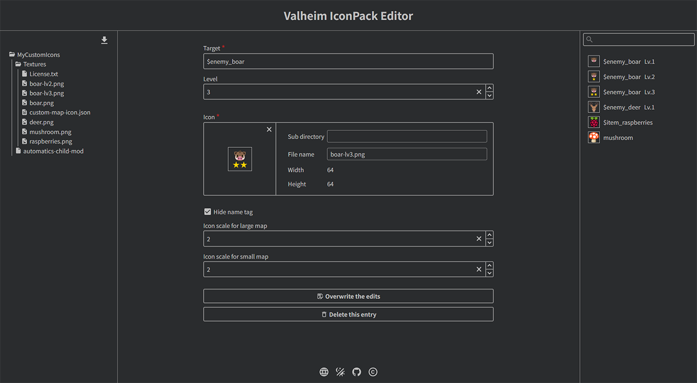

= Valheim IconPack Editor

== Overview
Valheim IconPack Editor is a tool for creating and editing link:https://github.com/eideehi/valheim-automatics/blob/main/docs/custom-icon-pack.adoc[Icon Packs] used in the Valheim mod "link:https://github.com/eideehi/valheim-automatics[Automatics]" to customize the icons displayed on the map.

== Use
You can use the Valheim IconPack Editor from link:https://eideehi.github.io/valheim-iconpack-editor[this link].

== License
Automatics is developed and released under the MIT license. For the full text of the license, please see the link:./LICENSE[license file].
